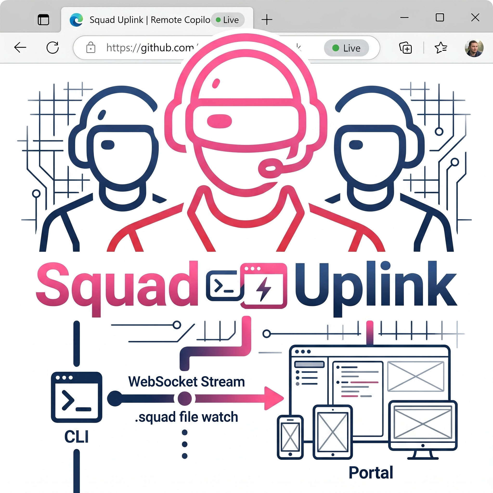
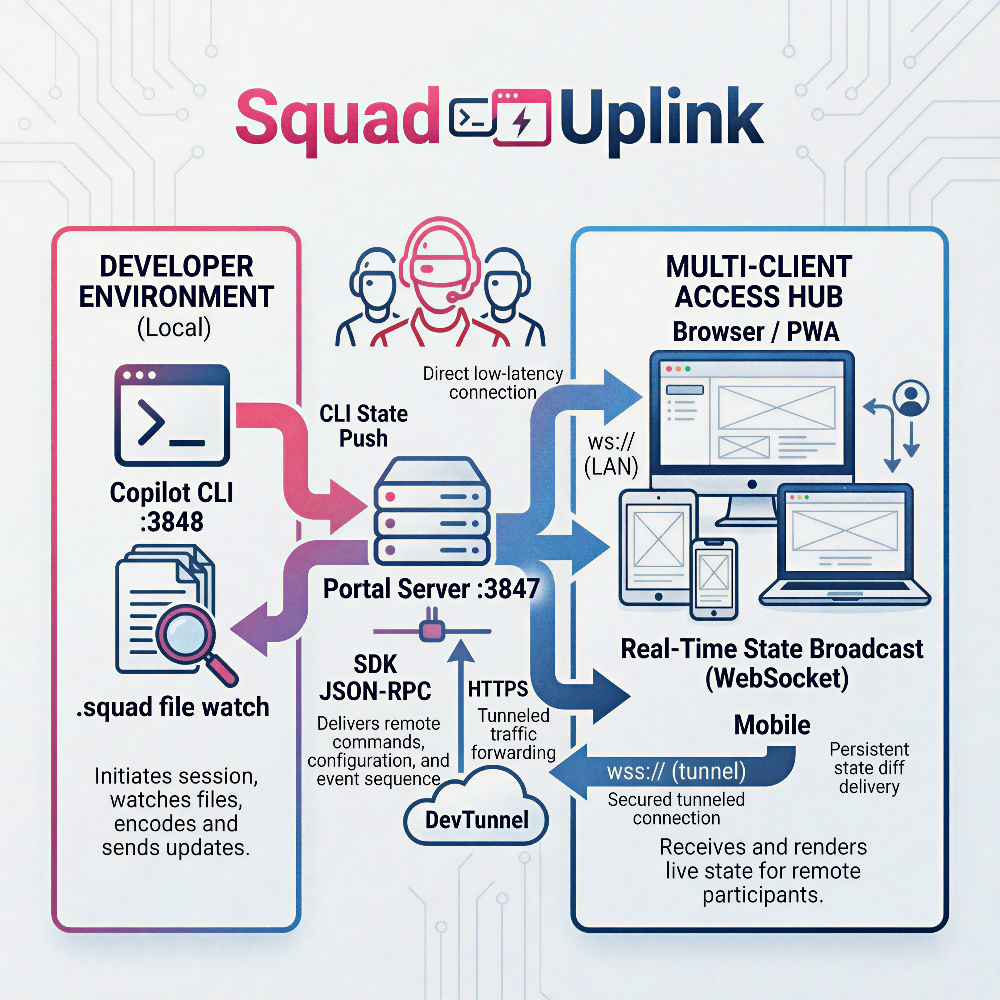

<div align="center">


### A portal for GitHub Copilot CLI with Squad intelligence

    
</div>

---

## What is Squad Uplink?

Squad Uplink is a browser-based portal for GitHub Copilot CLI. Instead of being tied to a single terminal window, you can interact with your Copilot CLI sessions from any browser — phone, tablet, or a second monitor — all in real time over WebSocket.

The project is built on [copilot-portal](https://github.com/shannonfritz/copilot-portal) by Shannon Fritz. Shannon's architecture does the hard work: a Node.js server bridges the `@github/copilot-sdk` IPC layer to a React SPA over WebSocket, handling multi-client fan-out, approval queuing, model switching, and CLI↔Portal sync. Squad Uplink extends that foundation with deep Squad intelligence — auto-injecting team context into Copilot sessions, live `.squad/` file watching over WebSocket, and an auto-generated prompt catalog from agent charters.

The portal ships with 8 retro terminal themes — Pip-Boy, Apple IIe, Commodore 64, Matrix, LCARS, MU-TH-UR, W.O.P.R., and Windows 95. Because command-line tools deserve a little personality.

---

## Architecture

<div align="center">

</div>

One `PortalServer` manages multiple Copilot sessions simultaneously. Each browser connection attaches as a listener on a `SessionHandle`, which fans events to all connected clients watching that session.

**Server:** Node.js + TypeScript, bundled with esbuild → `dist/server.js`

**Web UI:** React 19 + Vite 6 + Tailwind 4, built to `webui/dist/`

**Squad integration:** `.squad/` file API — reads `team.md`, `decisions.md`, and agent charters at runtime

| Layer | Technology |
|-------|-----------|
| Server runtime | Node.js 22+ |
| Server language | TypeScript 5 |
| SDK bridge | `@github/copilot-sdk` |
| WebSocket | `ws` |
| UI framework | React 19 |
| UI build | Vite 6 |
| UI styling | Tailwind CSS 4 |

---

## Getting Started

### Prerequisites

- **Node.js 22.5+** — [Download](https://nodejs.org/)
- **GitHub Copilot CLI** — must be installed and authenticated

### Install

```bash
git clone https://github.com/swigerb/squad-uplink.git
cd squad-uplink
npm install
cd webui && npm install && cd ..
```

### Build

```bash
# Build everything (server + UI)
npm run build

# Or build separately
npm run build:ext   # server only
npm run build:ui    # web UI only
```

### Run

```bash
# Start the portal (launches CLI window + portal server)
npm start
```

The server prints a URL and QR code on startup. Open the URL in any browser on your network.

**Dev mode** (server watches for changes, UI served by Vite dev server):

```bash
# Terminal 1 — watch server
npm run dev

# Terminal 2 — Vite dev server for UI
npm run watch:ui
```

---

## Features

### Portal Features

These capabilities come from the core portal architecture and upstream sync with copilot-portal:

#### Working Directory Support

Browse and set the working directory before creating sessions. The folder browser supports breadcrumb navigation and Windows drive letter detection. You can also change the CWD on existing sessions or start sessions in draft mode to configure them before launch.

#### Agent Picker

Select custom agents from the session drawer. Agents are discovered from `~/.copilot/agents/` (user-level) and `.github/agents/` (repository-level), with source labels so you know where each agent comes from. Your agent selection persists across sessions.

#### Tool Error Surfacing

When a tool call fails, the error is shown in red with the actual error message — not just a generic "failed" label. Error details persist after the turn ends so you can review what went wrong.

#### Copy Improvements

Every Markdown table gets a per-table copy button. Copied content strips dark theme colors for clean paste into other apps. Uses the Clipboard API with dual-format output (HTML + plain text) and an `execCommand` fallback that forces light styling.

#### ask_user Input

When Copilot asks you a question, you get a multi-line textarea with auto-grow — type naturally with Shift+Enter for newlines. The input timeout is 30 minutes, giving you time to think.

#### SDK Auto-Detection

The server auto-detects the tool approval format across Copilot SDK versions. Works with both legacy and current SDK wire formats without configuration.

#### Multi-Session Management

Run multiple Copilot sessions simultaneously. The session drawer lets you create, switch between, and manage sessions. Each session is independent with its own conversation history, model selection, and tool approvals.

#### Multi-Client Fan-Out

Multiple browsers can connect to the same session at once. All clients see the same conversation in real time over WebSocket — great for pairing, demos, or watching from your phone.

### Squad Features

Squad Uplink integrates deeply with your repo's `.squad/` directory across three levels:

#### Level 1 — Session Context Auto-Injection

Every Copilot session automatically receives your team context (roster + recent decisions) as its first message. Your AI conversations are team-aware from the start — no copy-pasting context. Opt out per session with `?squadContext=0`.

#### Level 2 — Live File Watching

The server watches `.squad/` for changes in real time via `fs.watch()`. When a team member updates `decisions.md` or a charter, the portal broadcasts a `squad_file_changed` WebSocket event and the Squad panel auto-refreshes — no manual reload.

#### Level 3 — Auto-Generated Prompt Catalog

Agent charters are parsed into one-click prompts (e.g., *"What is Woz responsible for?"*). These appear as a virtual "Squad" guide in the guides API alongside any custom guides, and are also available at `/api/squad/prompts`.

#### Squad API Endpoints

| Endpoint | Description |
|----------|-------------|
| `GET /api/squad/files` | List discoverable `.squad/` files |
| `GET /api/squad/file?path=X` | Read an allowed file's content |
| `GET /api/squad/team` | Team roster (shortcut) |
| `GET /api/squad/decisions` | Decision log (shortcut) |
| `GET /api/squad/guide` | Compiled team context guide |
| `GET /api/squad/prompts` | Auto-generated prompt catalog |

### Security

All file access goes through a security allowlist — only approved files are exposed. The folder browser includes path traversal protection, CWD validation, and symlink filtering. Auth endpoints use rate limiting to prevent abuse.

---

## Themes 🎨

Squad Uplink includes 8 retro terminal themes, switchable from the UI:

| Theme | Vibe |
|-------|------|
| **Pip-Boy** | Fallout Vault-Tec amber on deep black, walking Vault Boy, CRT scanline overlay |
| **Apple IIe** | Green phosphor on black, 80-column nostalgia |
| **Commodore 64** | Blue-on-blue PETSCII warmth |
| **Matrix** | Falling green rain, digital noir |
| **LCARS** | Star Trek TNG bridge console, rounded panels |
| **MU-TH-UR** | Alien mainframe, cold clinical interface |
| **W.O.P.R.** | WarGames missile command aesthetic |
| **Windows 95** | Beveled gray, start menu energy |

Themes use CSS custom properties and conditional layout wrappers. The Pip-Boy theme includes a CRT overlay effect; Matrix includes animated rain. Theme selection persists via localStorage.

---

## Credits & Attribution

Squad Uplink is built on [copilot-portal](https://github.com/shannonfritz/copilot-portal) by **Shannon Fritz** ([@shannonfritz](https://github.com/shannonfritz)). The core architecture — WebSocket server, session management, approval flow, CLI↔Portal sync, and the React SPA — comes from Shannon's work. This repo extends it with Squad-specific features.

---

## Built with Squad

This project is developed by an AI team managed by [Squad](https://github.com/bradygaster/squad) — a Git-native AI agent orchestration framework. The team (Jobs, Woz, Kare, Hertzfeld, Scribe, Ralph) lives in `.squad/` and coordinates through this repo.

---

## License

MIT License — same as the upstream [copilot-portal](https://github.com/shannonfritz/copilot-portal). See [LICENSE](LICENSE) for details.
