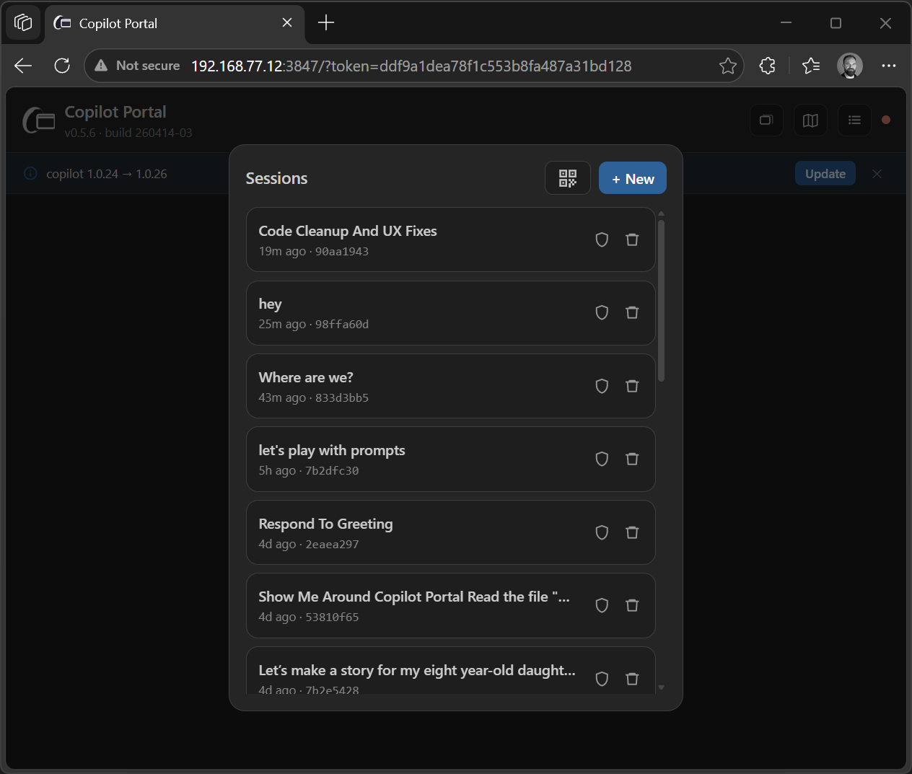
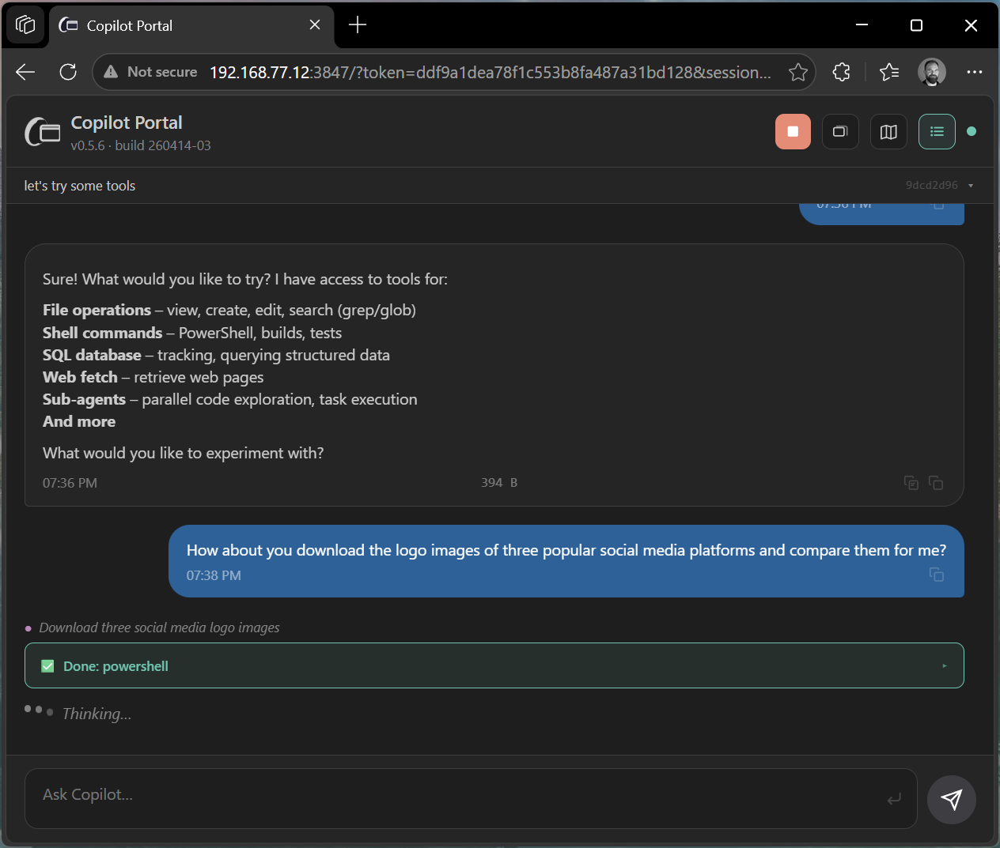
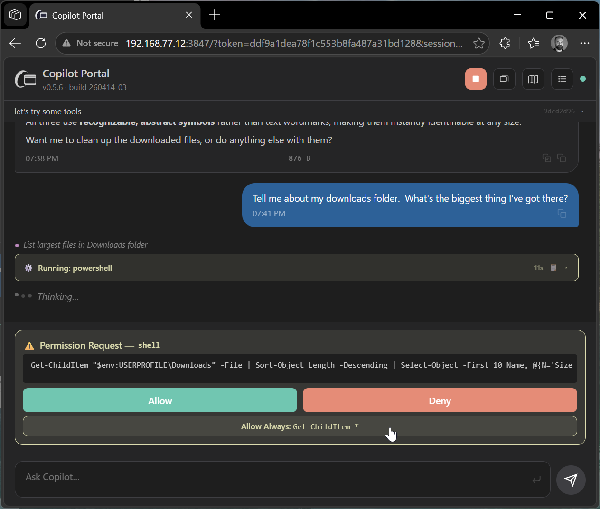
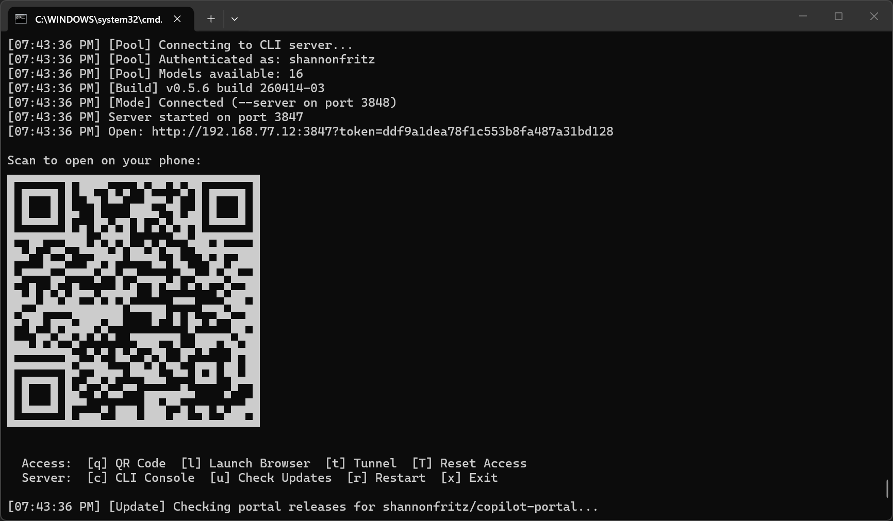
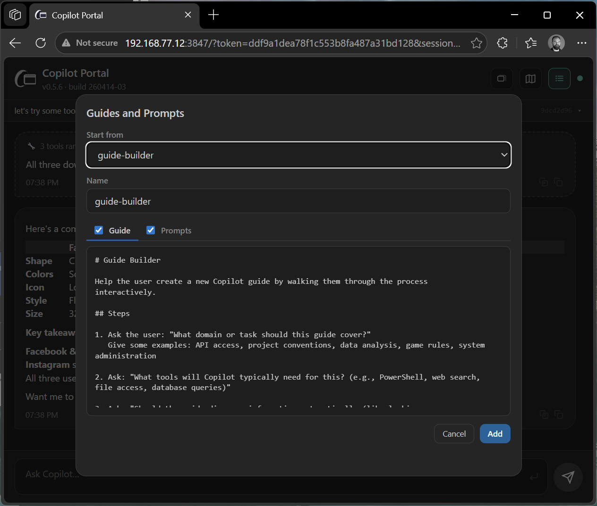
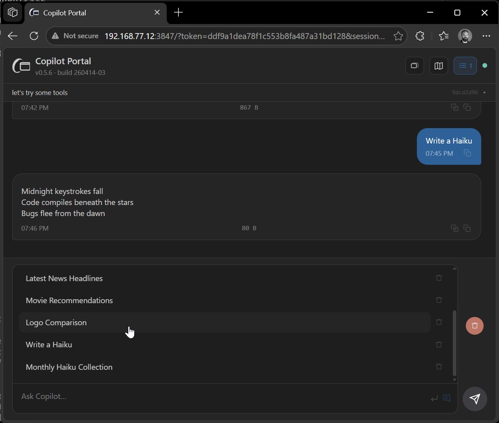
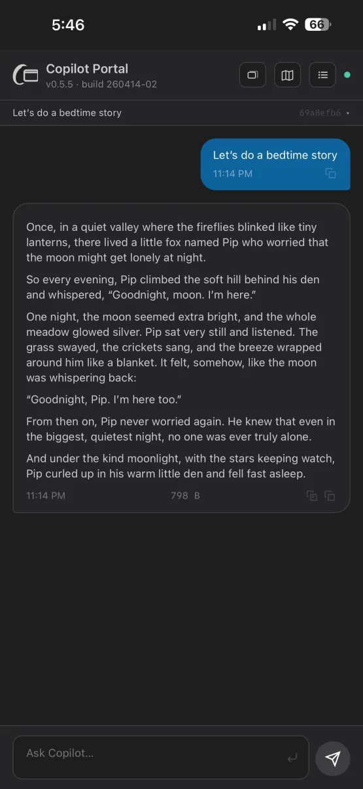
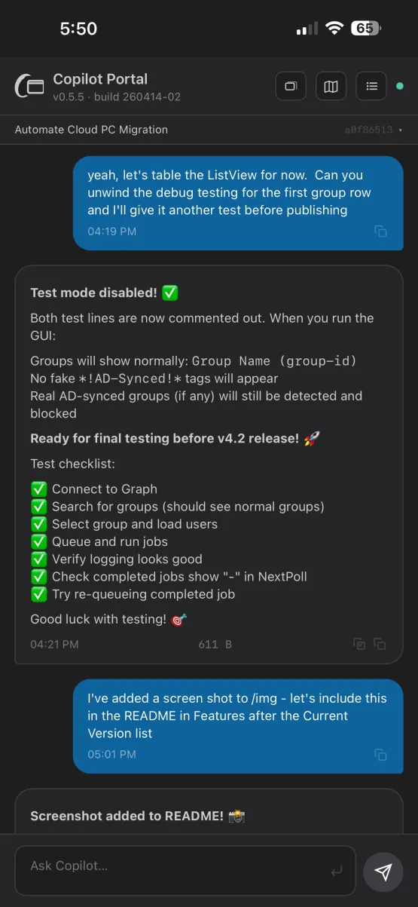
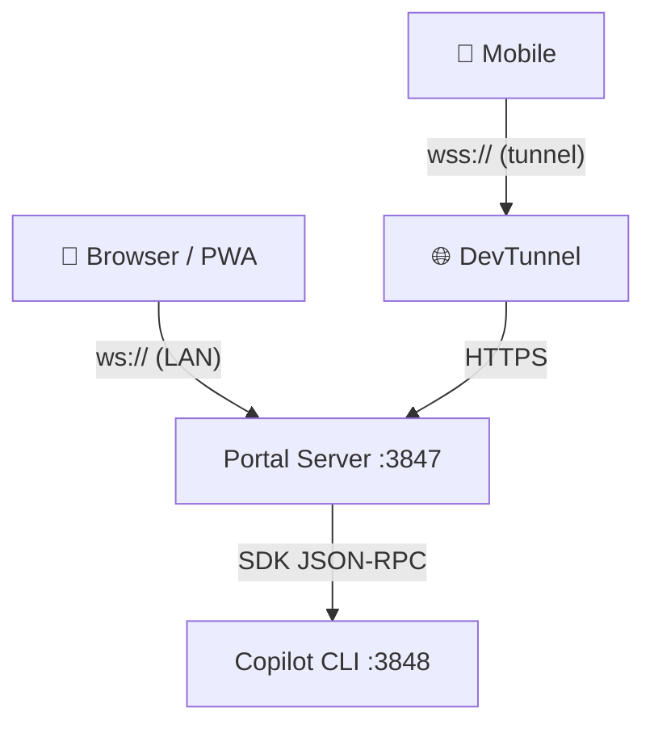

# Squad Uplink

Squad Uplink is a Squad-aware web portal for GitHub Copilot CLI sessions, based on Shannon Fritz's [Copilot Portal](https://github.com/shannonfritz/copilot-portal). Start the server on your PC or in a container, then open the URL on any device — same network via QR code, or anywhere via DevTunnels.

This project still makes sense in the current Squad ecosystem, but with a narrower job than the original "remote terminal" idea. Brady Gaster's Squad now runs directly through GitHub Copilot CLI:

```bash
npm install -g @bradygaster/squad-cli
squad init
copilot --agent squad --remote
```

`--remote` is the native Copilot CLI remote-access flag, and AKS/ACA deployments can run Squad sessions headlessly. Squad Uplink therefore should not compete with that path. Its value is the browser layer around it: `.squad/` state visibility, Squad-aware prompt injection, agent/charter context, multi-client approvals, mobile UX, and optional stakeholder-friendly status.

## Features

- **Chat with Copilot** — full session management, model switching, tool approvals
- **Image attachments** — paste, drag & drop, or pick images to include in messages
- **Context window bar** — visual breakdown of token usage (system, messages, free space)
- **Rich model picker** — context size, vision/thinking support, and cost multiplier per model
- **Agent picker** — select custom agents from `~/.copilot/agents/` or `.github/agents/`
- **Guides & Prompts** — markdown instructions and canned prompts, import from Gists
- **Working directory** — browse and change per-session CWD with folder picker
- **Themes** — per-session color themes with randomizer
- **Mobile-first** — responsive design, PWA support, touch-friendly
- **Multi-device** — use the same session from PC and phone simultaneously
- **In-portal updates** — check for and apply CLI/SDK updates without leaving the browser
- **Remote access** — DevTunnel integration for HTTPS access from anywhere
- **Run in a container** — optional headless/NAS deployment via a published Docker image (TrueNAS SCALE, Synology, any Docker host)
- **Squad state panel** — browse `.squad/team.md`, `.squad/decisions.md`, and approved Squad files from the portal
- **Squad context injection** — automatically prepends compact team/decision context to the first prompt in a session
- **Squad package source** — includes `@bradygaster/squad-cli` so container/remote deployments can run current Squad workflows

## Current Squad remote guidance

Use the native Squad/Copilot path when you only need remote access to a running agent session:

```bash
copilot --agent squad --remote
```

Use AKS or Azure Container Apps when you want isolated, headless Squad sessions. In that pattern, each container/job runs Copilot CLI with the Squad agent and `--remote`; Squad Uplink can sit beside it as the human-friendly portal for session management and `.squad/` state, not as the execution substrate.

The old Squad PTY/devtunnel remote-control flow is deprecated upstream. Keep Uplink focused on the portal capabilities that GitHub remote, the Copilot app, Aspire, AKS, and ACA do not cover: rendered Squad memory, charters, decisions, prompts, and cross-device approvals.

## Prerequisites

- [Node.js](https://nodejs.org/) v22 or later
- [GitHub Copilot CLI](https://docs.github.com/copilot/how-tos/copilot-cli) — `winget install GitHub.CopilotCLI` (Windows) or `brew install gh-copilot` (macOS)
- [Squad CLI](https://github.com/bradygaster/squad) — included as an npm dependency for this repo and installable globally with `npm install -g @bradygaster/squad-cli`

## Getting Started

1. Unzip the release to a folder (e.g. `C:\squad-uplink`).
2. Run `start-portal.cmd` (Windows) or `sh start-portal.sh` (macOS/Linux).
3. Press **`l`** to launch the portal in your browser.

On first run, the script will:
- Install **Node.js** and **PowerShell 7** via winget if missing (restart terminal after install)
- Install npm dependencies
- Sign you in to **GitHub** (opens a browser for authentication)
- Start the Copilot CLI server in the background

> **Prerequisite:** You need a GitHub account with Copilot access. Check at [github.com/settings/copilot](https://github.com/settings/copilot).

<a href="img/screenshot-sessions.png"></a>

<p>
<a href="img/screenshot-tools.png"></a>
<a href="img/screenshot-approvals.png"></a>
</p>

## Run in a container (headless / NAS)

Prefer an always-on, headless deployment (TrueNAS SCALE, Synology, or any Docker
host)? A published image bundles the portal **and** the Copilot CLI with a ready
agent toolset (Python/`uv`, `git`, `gh`, `jq`, PowerShell, …):

```bash
docker run -d -p 3847:3847 \
  -v copilot-home:/home/copilot \
  -v portal-data:/app/data \
  -v "$(pwd)/work:/work" \
  ghcr.io/swigerb/squad-uplink:latest
# then open http://<host>:3847 and sign in to GitHub from the web UI
```

Or use the repo's `docker-compose.yml`. Auth, sessions, and agent-installed tools
persist in the `copilot-home` volume across image updates. See
**[docs/DOCKER.md](docs/DOCKER.md)** for the full guide — volumes, authentication,
the TrueNAS Custom App walkthrough, sharing `/work` over SMB, and updates.

## Console Keys

While the server is running, press a key in the terminal:

| | Access | | Server |
|---|---|---|---|
| **q** | QR code & URL | **c** | CLI console |
| **l** | Launch browser | **u** | Check updates |
| **t** | Start/stop tunnel | **r** | Restart |
| **T** | Security reset | **x** | Exit |

**Tunnel** creates a DevTunnel for remote access (HTTPS from anywhere). Press **t** to start, **t** again to stop. First time, it asks about access settings. The tunnel auto-restarts after a server restart.

**Security reset** (Shift+T) destroys the tunnel, rotates the access token, and disconnects all clients. Use if a URL was compromised. Press **q** for a new QR code, then **t** for a new tunnel.

<a href="img/screenshot-console.png"></a>

## Guides & Prompts

Guides are markdown files that teach Copilot how to behave for a session. Prompts are canned queries that appear in an overlay above the message box.

- Click the map icon in the header to browse, apply, edit, or create guides and prompts
- **+ New** — start from scratch, pick from example templates, or import from a GitHub Gist URL
- Prompts float above the input area without resizing the chat
- Files live in `data/guides/` and `data/prompts/` — same filename pairs them
- Prompts stack across multiple sources and persist per session

<p>
<a href="img/screenshot-guides.png"></a>
<a href="img/screenshot-prompts.png"></a>
</p>

### Importing

Share guides via GitHub Gists using the naming convention:
```
my-guide_guide.md       → guide content
my-guide_prompts.md     → companion prompts
```

Import via **+ New → Import from URL** in the portal.

## Squad integration

Squad Uplink reads a safe allowlist from `.squad/`:

- `team.md`, `decisions.md`, `routing.md`, `ceremonies.md`
- `orchestration-log/*.md`
- `agents/*/charter.md`

The portal exposes these through `/api/squad/*`, broadcasts `squad_file_changed` events over WebSocket, and generates compact prompt context from the roster and latest decisions. Add `?squadContext=0` to the portal URL if you need to disable automatic Squad context injection for a session.

Package installation is configured through `.npmrc` to use Microsoft's approved npm upstream feed:

```ini
registry=https://packagefeedproxy.microsoft.io/npm/
```

Current approved-feed pins are `@github/copilot@1.0.69-3`, `@github/copilot-sdk@1.0.6-preview.1`, `@bradygaster/squad-cli@0.11.0`, and `ws@8.21.0`.

## Mobile & PWA

- Scan the QR code to open on your phone (same network)
- Use Share → Add to Home Screen for a standalone app experience
- Press **t** in the terminal for remote access via DevTunnel

<p>
<a href="img/screenshot-mobile1.png"></a>
<a href="img/screenshot-mobile2.png"></a>
<a href="img/screenshot-mobile3.png"></a>
</p>

## Security

- All API and WebSocket endpoints require a token (generated on first run, saved to `data/token.txt`)
- Security headers: CSP, HSTS (over tunnel), X-Frame-Options, referrer policy
- Rate limiting on failed auth attempts
- Press **T** to rotate the token and revoke all access

## Architecture

The portal connects to a headless Copilot CLI server running in the background. Messages are bidirectional — the CLI console and portal share the same sessions.


```mermaid
graph TD
    Browser["📱 Browser / PWA"] -->|"ws:// (LAN)"| Portal["Portal Server :3847"]
    Phone["📱 Mobile"] -->|"wss:// (tunnel)"| Tunnel["🌐 DevTunnel"]
    Tunnel -->|HTTPS| Portal
    Portal -->|SDK JSON-RPC| CLI["Copilot CLI :3848"]
```

<details>
<summary>ASCII version</summary>

```
  📱 Browser / PWA          📱 Mobile
        │                       │
    ws:// (LAN)          wss:// (tunnel)
        │                       │
        ▼                       ▼
  Portal Server :3847 ◄── 🌐 DevTunnel
        │
   SDK JSON-RPC
        │
        ▼
  Copilot CLI :3848
```
</details>

## Configuration

| Flag | Default | Description |
|---|---|---|
| `--port N` | 3847 | Portal server port |
| `--cli-url URL` | auto | Connect to a specific CLI server |
| `--data DIR` | `data/` | Data directory for token, rules, guides |
| `--new-token` | — | Generate a new access token on start |
| `--launch` | — | Open browser on start |
| `--no-qr` | — | Suppress QR code output |

---

## Development

For contributors working from the source repository.

```bash
npm install          # install dependencies
npm run build        # build server + web UI
npm run package      # create release zip
```

### Versioning

- **Version** (`v0.8.0`) — semver in `package.json`, bumped for releases
- **Build** (`260414-01`) — `YYMMDD-NN` in `BUILD`, auto-incremented by `npm run package`

### Project Structure

```
src/              Server source (TypeScript)
webui/src/        React UI source
dist/             Compiled output
examples/         Shipped guide/prompt templates (read-only)
data/             User runtime data (gitignored)
docs/             Design docs and specs
```
